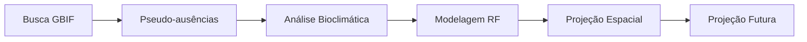

# 🌿 TAIPA SDM - Plataforma Educacional de Modelagem de Distribuição de Espécies


## 📋 Visão Geral

TAIPA (Tecnologia Aplicada para Pesquisa Ambiental) é uma plataforma educacional completa para Modelagem de Distribuição de Espécies (SDM), oferecendo um fluxo de trabalho integrado desde a coleta de dados até projeções futuras considerando mudanças climáticas.

## ✨ Funcionalidades Principais

- 🌍 **Integração com GBIF** para busca de dados de ocorrência de espécies
- 🗺️ **Mapas interativos** para visualização e filtragem de dados
- 🌡️ **19 variáveis bioclimáticas** do WorldClim
- 🤖 **Machine Learning** com Random Forest otimizado para SDM
- 📊 **Validação Cruzada Espacial** para métricas mais realistas
- 🔮 **Projeções futuras** com cenários climáticos (SSP1-2.6 e SSP5-8.5)
- 💾 **Gerenciamento de modelos** com save/load persistente

## 🚀 Melhorias Recentes (2025)

### Correções Críticas
- ✅ **Validação Cruzada Espacial**: Implementada para lidar com autocorrelação espacial
- ✅ **Seleção de Variáveis VIF**: Algoritmo robusto para redução de multicolinearidade

### Correções de Precisão
- ✅ **Buffer geográfico**: Cálculo correto considerando variação de longitude com latitude
- ✅ **Escala de temperatura**: Correção automática para dados WorldClim (÷10)

### Qualidade de Código
- ✅ Tratamento específico de warnings ao invés de supressão global
- ✅ Exceções específicas ao invés de genéricas
- ✅ Constantes definidas para valores geográficos
- ✅ Imports organizados e otimizados

## 📁 Estrutura do Projeto

```
Taipa_v2/
├── app.py                          # Aplicação principal Streamlit
├── requirements.txt                # Dependências do projeto
├── pages/                          # Módulos da aplicação
│   ├── pagina_busca_api.py        # Busca de espécies no GBIF
│   ├── pagina_pseudoausencias.py   # Geração de pseudo-ausências
│   ├── pagina_analise_bioclimatica.py # Análise de variáveis ambientais
│   ├── pagina_modelagem.py         # Treinamento e avaliação de modelos
│   ├── pagina_projecao_espacial.py # Mapas de adequabilidade
│   └── pagina_projecao_futura.py   # Projeções com mudanças climáticas
├── utils/                          # Módulos utilitários
│   ├── gbif_api.py                # Interface com API do GBIF
│   ├── geo_utils.py               # Utilidades geográficas
│   ├── brazil_boundary.py         # Limites do Brasil
│   ├── bioclim_analysis_optimized.py # Análise bioclimática otimizada
│   ├── modeling.py                # Classes de modelagem
│   ├── model_evaluation.py        # Avaliação de modelos
│   ├── spatial_cv.py              # Validação cruzada espacial
│   └── model_manager.py           # Gerenciamento de modelos salvos
├── data/                          # Dados do projeto
│   ├── worldclim_brazil/          # Variáveis bioclimáticas do Brasil
│   └── worldclim_future/          # Projeções climáticas futuras
└── models/                        # Modelos treinados salvos
```

## 🛠️ Instalação

### Pré-requisitos
- Python 3.12 ou superior
- Git (opcional)

### Passos

1. **Clone o repositório**
```bash
git clone https://github.com/seu-usuario/Taipa_v2.git
cd Taipa_v2
```

2. **Crie um ambiente virtual**
```bash
python -m venv venv
source venv/bin/activate  # No Windows: venv\Scripts\activate
```

3. **Instale as dependências**
```bash
pip install -r requirements.txt
```

4. **Baixe os dados climáticos** (se não incluídos)
```bash
python download_future_climate.py
```

## 🎮 Como Usar

1. **Inicie a aplicação**
```bash
streamlit run app.py
```

2. **Acesse no navegador**
```
http://localhost:8501
```

3. **Siga o fluxo de trabalho**
   - Módulo 1: Busque dados de ocorrência da espécie
   - Módulo 2: Gere pseudo-ausências
   - Módulo 3: Analise variáveis bioclimáticas
   - Módulo 4: Treine o modelo
   - Módulo 5: Gere mapas de distribuição
   - Módulo 6: Projete cenários futuros

## 📊 Fluxo de Trabalho SDM



## 🔧 Configurações Principais

### Validação Cruzada Espacial
- Agrupa dados geograficamente
- Buffer configurável (padrão: 10km)
- Evita superestimação de métricas

### Seleção de Variáveis
- Método robusto baseado em VIF e correlação
- Threshold VIF: 10.0
- Threshold correlação: 0.7

### Random Forest
- 500 árvores (configurável)
- Profundidade máxima: 20
- Otimizado para dados ecológicos

## 📚 Tecnologias Utilizadas

- **[Streamlit](https://streamlit.io/)** 1.45.1 - Interface web
- **[Pandas](https://pandas.pydata.org/)** - Manipulação de dados
- **[NumPy](https://numpy.org/)** - Computação numérica
- **[scikit-learn](https://scikit-learn.org/)** - Machine Learning
- **[Rasterio](https://rasterio.readthedocs.io/)** - Dados raster
- **[GeoPandas](https://geopandas.org/)** - Dados geoespaciais
- **[Folium](https://python-folium.readthedocs.io/)** - Mapas interativos
- **[Plotly](https://plotly.com/python/)** - Visualizações interativas

## 🤝 Contribuindo

Contribuições são bem-vindas! Por favor:

1. Fork o projeto
2. Crie uma branch para sua feature (`git checkout -b feature/AmazingFeature`)
3. Commit suas mudanças (`git commit -m 'Add some AmazingFeature'`)
4. Push para a branch (`git push origin feature/AmazingFeature`)
5. Abra um Pull Request

## 📝 Citação

Se usar esta plataforma em trabalhos acadêmicos, por favor cite:

```bibtex
@software{taipa_sdm_2025,
  title = {TAIPA SDM: Plataforma Educacional de Modelagem de Distribuição de Espécies},
  year = {2025},
  url = {https://github.com/seu-usuario/Taipa_v2}
}
```

## ⚠️ Avisos Importantes

- Os dados do WorldClim são fornecidos em resolução de 2.5 minutos
- Projeções futuras usam modelo MPI-ESM1-2-HR (único GCM para fins educacionais)
- Validação cruzada espacial é essencial para SDM realista
- Sempre verifique a qualidade dos dados do GBIF antes de modelar

## 📞 Contato

TAIPA SDM - Plataforma de Educação em Pesquisa Ambiental

---

*Desenvolvido com 💚 para educação em conservação da biodiversidade*